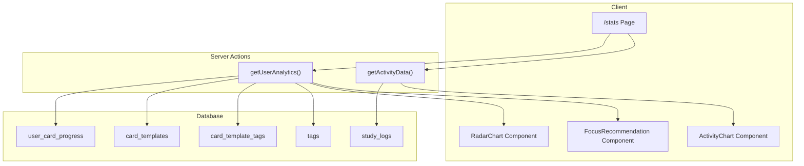

# Design Document: V10.2 The Weakness Hunter

## Overview

V10.2 introduces an Analytics Dashboard that transforms raw study data into actionable insights. The system aggregates user performance data by topic tags, visualizes strengths and weaknesses through charts, and provides targeted recommendations for improvement.

The architecture follows the existing patterns: Server Actions for data fetching, React components for visualization, and the V2 Shared Library schema (user_card_progress, card_templates, card_template_tags, tags).

## Architecture



## Components and Interfaces

### Server Actions

#### `getUserAnalytics(): Promise<AnalyticsResult>`

Location: `src/actions/analytics-actions.ts`

```typescript
interface TopicAccuracy {
  tagId: string;
  tagName: string;
  accuracy: number;        // 0-100, null if no attempts
  correctCount: number;
  totalAttempts: number;
  isLowConfidence: boolean; // true if totalAttempts < 5
}

interface DeckProgress {
  deckId: string;
  deckTitle: string;
  cardsLearned: number;    // cards with at least 1 review
  totalCards: number;
}

interface AnalyticsResult {
  success: boolean;
  topicAccuracies: TopicAccuracy[];
  deckProgress: DeckProgress[];
  weakestTopic: TopicAccuracy | null;
  error?: string;
}
```

Query Strategy:
- Join `user_card_progress` with `card_templates` via `card_template_id`
- Join `card_template_tags` and `tags` to get topic categorization
- Filter tags by `category = 'topic'` for the radar chart
- Aggregate: `SUM(correct_count)` / `SUM(total_attempts)` per tag
- Use a single optimized query with GROUP BY to avoid N+1

#### `getActivityData(days: number): Promise<ActivityResult>`

Location: `src/actions/analytics-actions.ts`

```typescript
interface DailyActivity {
  date: string;           // ISO date string
  dayName: string;        // "Mon", "Tue", etc.
  cardsReviewed: number;
}

interface ActivityResult {
  success: boolean;
  activity: DailyActivity[];  // Always 7 items
  error?: string;
}
```

Query Strategy:
- Query `study_logs` for last 7 days
- Fill in missing days with zero counts
- Format dates to day names

### React Components

#### `StatsPage` (Server Component)

Location: `src/app/(app)/stats/page.tsx`

- Fetches analytics data via Server Actions
- Renders loading skeleton while data loads
- Passes data to child chart components

#### `RadarChart` (Client Component)

Location: `src/components/analytics/RadarChart.tsx`

- Uses `recharts` `<RadarChart>` component
- Normalizes accuracy to 0-100 scale
- Displays tooltip on hover with accuracy % and attempt count
- Visual indicator (dashed line or opacity) for low-confidence data points

#### `ActivityChart` (Client Component)

Location: `src/components/analytics/ActivityChart.tsx`

- Uses `recharts` `<BarChart>` component
- Shows 7 days of activity
- Glassmorphic styling (semi-transparent bars)
- Tooltip shows exact count on hover

#### `FocusRecommendation` (Client Component)

Location: `src/components/analytics/FocusRecommendation.tsx`

- Displays weakest topic name and accuracy
- "Improve [Topic]" button links to `/study/custom?tagIds=[tagId]&mode=due`
- Shows encouragement message if no sufficient data

### Navigation Updates

#### `MobileNavBar` Update

Add Stats item to `NAV_ITEMS`:
```typescript
{ href: '/stats', icon: <BarChart3 className="h-5 w-5" />, label: 'Stats' }
```

## Data Models

### Existing Tables Used

| Table | Purpose |
|-------|---------|
| `user_card_progress` | Tracks user's SRS state per card (interval, ease_factor, repetitions) |
| `card_templates` | Card content linked to deck_templates |
| `card_template_tags` | Many-to-many join between cards and tags |
| `tags` | Tag definitions with category (source/topic/concept) |
| `study_logs` | Daily activity counts per user |

### Accuracy Calculation

The accuracy formula requires tracking correct vs incorrect answers. Currently, `user_card_progress` tracks SRS state but not explicit correct/incorrect counts.

**Option A: Derive from SRS state**
- Cards with `repetitions > 0` and `ease_factor >= 2.5` = likely correct
- Cards with `ease_factor < 2.5` = struggled

**Option B: Add tracking columns** (Recommended)
Add to `user_card_progress`:
```sql
ALTER TABLE user_card_progress 
ADD COLUMN correct_count INTEGER DEFAULT 0,
ADD COLUMN total_attempts INTEGER DEFAULT 0;
```

Update `recordAnswer` action to increment these counters.

### SQL View for Analytics (Optional Optimization)

```sql
CREATE VIEW user_topic_accuracy AS
SELECT 
  ucp.user_id,
  t.id as tag_id,
  t.name as tag_name,
  SUM(ucp.correct_count) as correct_count,
  SUM(ucp.total_attempts) as total_attempts,
  CASE 
    WHEN SUM(ucp.total_attempts) > 0 
    THEN (SUM(ucp.correct_count)::float / SUM(ucp.total_attempts)) * 100
    ELSE NULL
  END as accuracy
FROM user_card_progress ucp
JOIN card_templates ct ON ct.id = ucp.card_template_id
JOIN card_template_tags ctt ON ctt.card_template_id = ct.id
JOIN tags t ON t.id = ctt.tag_id
WHERE t.category = 'topic'
GROUP BY ucp.user_id, t.id, t.name;
```

## Correctness Properties

*A property is a characteristic or behavior that should hold true across all valid executions of a system-essentially, a formal statement about what the system should do. Properties serve as the bridge between human-readable specifications and machine-verifiable correctness guarantees.*

### Property 1: Accuracy calculation produces valid percentages

*For any* correct_count and total_attempts where total_attempts > 0, the calculated accuracy SHALL be equal to (correct_count / total_attempts) * 100 and SHALL be in the range [0, 100].

**Validates: Requirements 1.2, 3.2**

### Property 2: Learned count never exceeds total count

*For any* deck progress data, the cardsLearned value SHALL be less than or equal to totalCards.

**Validates: Requirements 1.5**

### Property 3: Navigation active state detection

*For any* pathname starting with "/stats", the isNavItemActive function SHALL return true for the stats nav item.

**Validates: Requirements 2.4**

### Property 4: Radar chart data contains all topics

*For any* set of topic accuracies, the radar chart data transformation SHALL produce one data point per topic with the accuracy value normalized to 0-100.

**Validates: Requirements 3.1**

### Property 5: Low confidence threshold

*For any* topic accuracy with totalAttempts < 5, the isLowConfidence flag SHALL be true; for totalAttempts >= 5, it SHALL be false.

**Validates: Requirements 3.3**

### Property 6: Activity data covers exactly 7 days

*For any* call to getActivityData(7), the returned activity array SHALL contain exactly 7 items, one for each of the last 7 days including today.

**Validates: Requirements 4.1**

### Property 7: Day name formatting

*For any* valid date, the formatDayName function SHALL return a three-letter day abbreviation ("Mon", "Tue", "Wed", "Thu", "Fri", "Sat", "Sun").

**Validates: Requirements 4.2**

### Property 8: Weakest topic identification with tiebreaker

*For any* non-empty set of topic accuracies, the identified weakest topic SHALL have the minimum accuracy value. When multiple topics share the minimum accuracy, the one with the highest totalAttempts SHALL be selected.

**Validates: Requirements 5.1, 5.4**

### Property 9: Improve button URL construction

*For any* topic with a valid tagId, the generated improve URL SHALL be `/study/custom?tagIds=[tagId]&mode=due` where [tagId] is the exact tag ID.

**Validates: Requirements 5.3**

## Error Handling

| Scenario | Handling |
|----------|----------|
| User not authenticated | Return error, redirect to login |
| No study data | Show empty state with encouragement message |
| Database query fails | Return error message, show retry option |
| Zero attempts for topic | Exclude from accuracy calculation, show as "No data" |
| Recharts render error | Graceful fallback to text-based stats |

## Testing Strategy

### Dual Testing Approach

This feature uses both unit tests and property-based tests:

- **Unit tests**: Verify specific examples, edge cases (zero attempts, empty data), and integration points
- **Property-based tests**: Verify universal properties hold across all valid inputs using fast-check

### Property-Based Testing

Library: `fast-check` (already configured in project)

Test file: `src/__tests__/analytics.property.test.ts`

Each property test will:
1. Generate random valid inputs using fast-check arbitraries
2. Execute the function under test
3. Assert the property holds for all generated inputs
4. Run minimum 100 iterations per property

Format for property test comments:
```typescript
// **Feature: v10.2-weakness-hunter, Property 1: Accuracy calculation produces valid percentages**
// **Validates: Requirements 1.2, 3.2**
```

### Unit Testing

Test file: `src/__tests__/analytics.test.ts`

Unit tests cover:
- Edge case: topic with zero attempts returns null accuracy
- Edge case: empty topic list returns empty array
- Edge case: all topics have same accuracy (tiebreaker test)
- Integration: getUserAnalytics returns expected shape
- Integration: getActivityData fills missing days with zeros
