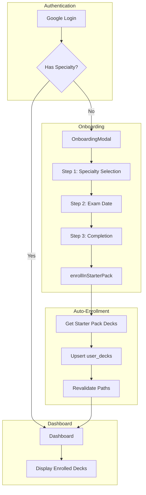

# Design Document: V10.5 Brand Unification & Starter Packs

## Overview

This design covers two feature sets for the Specialize application:

1. **Brand Unification**: Replace remaining legacy brand names with "Specialize" and verify PWA build configuration
2. **Starter Packs**: Enhance onboarding to auto-enroll users in curated deck collections based on specialty

The implementation prioritizes minimal changes to existing architecture while adding the auto-enrollment capability.

## Architecture



## Components and Interfaces

### Modified Components

#### 1. Landing Page (`src/app/page.tsx`)
- Update `<h1>` text from "ResidencyOS" to "Specialize"
- Update tagline to match new branding

#### 2. Stats Page Metadata (`src/app/(app)/stats/page.tsx`)
- Update `title` from "Stats | ResidencyOS" to "Stats | Specialize"

#### 3. OnboardingModal (`src/components/onboarding/OnboardingModal.tsx`)
- Remove ability to skip specialty selection step
- Call `enrollInStarterPack` on completion
- Redirect to dashboard instead of library after enrollment

### New Components

#### 4. Server Action: `enrollInStarterPack`

Location: `src/actions/onboarding-actions.ts`

```typescript
interface EnrollResult {
  success: boolean;
  enrolledCount: number;
  error?: string;
}

async function enrollInStarterPack(specialty: string): Promise<EnrollResult>
```

**Responsibilities:**
- Map specialty to starter pack deck IDs
- Upsert `user_decks` records for each deck
- Revalidate dashboard and library paths

### Starter Pack Configuration

For V1, hardcode the OBGYN starter pack:

```typescript
const STARTER_PACKS: Record<string, string[]> = {
  'OBGYN': [
    // Deck template IDs for OBGYN starter content
    // To be populated with actual deck IDs from database
  ],
};
```

## Data Models

### Existing Tables Used

#### user_decks
```sql
CREATE TABLE user_decks (
  id UUID PRIMARY KEY DEFAULT gen_random_uuid(),
  user_id UUID NOT NULL REFERENCES auth.users(id),
  deck_template_id UUID NOT NULL REFERENCES deck_templates(id),
  is_active BOOLEAN DEFAULT true,
  created_at TIMESTAMPTZ DEFAULT now(),
  UNIQUE(user_id, deck_template_id)
);
```

### User Metadata Schema

```typescript
interface UserMetadata {
  onboarded?: boolean;
  specialty?: string;
  examDate?: string | null;
}
```

## Correctness Properties

*A property is a characteristic or behavior that should hold true across all valid executions of a system-essentially, a formal statement about what the system should do. Properties serve as the bridge between human-readable specifications and machine-verifiable correctness guarantees.*

### Property 1: Onboarding Modal Visibility Logic

*For any* user metadata object, if the `onboarded` field is not `true`, then `shouldShowOnboardingModal` should return `true`.

**Validates: Requirements 3.1**

### Property 2: Specialty Selection Required for Progression

*For any* empty or whitespace-only specialty value, the continue button on step 1 of the OnboardingModal should be disabled.

**Validates: Requirements 3.3**

### Property 3: Specialty Persistence Round-Trip

*For any* valid specialty selection from the SPECIALTIES list, after completing onboarding, querying user metadata should return that same specialty value.

**Validates: Requirements 3.5**

### Property 4: Starter Pack Enrollment Creates Active Subscriptions

*For any* supported specialty (currently OBGYN), calling `enrollInStarterPack` should create `user_decks` records where each record has `is_active = true`.

**Validates: Requirements 4.1, 4.2**

### Property 5: Starter Pack Enrollment Idempotence

*For any* user and specialty, calling `enrollInStarterPack` multiple times should result in the same number of subscription records (no duplicates created).

**Validates: Requirements 4.4**

## Error Handling

| Scenario | Handling |
|----------|----------|
| User metadata update fails | Display error message in modal, allow retry |
| enrollInStarterPack fails | Log error, continue to dashboard (graceful degradation) |
| Deck template not found | Skip that deck, continue with remaining starter pack decks |
| Database connection error | Display generic error, suggest refresh |

## Testing Strategy

### Property-Based Testing

**Library:** fast-check (already configured in project)

**Configuration:** Minimum 100 iterations per property test

**Test File:** `src/__tests__/onboarding.property.test.ts`

Each property test will be tagged with:
```typescript
/**
 * **Feature: v10.5-brand-unification-starter-packs, Property N: [Property Name]**
 * **Validates: Requirements X.Y**
 */
```

### Unit Tests

**Test File:** `src/__tests__/onboarding.test.ts`

Unit tests will cover:
- Brand name presence in landing page
- Stats page metadata title
- OnboardingModal renders specialty options
- OnboardingModal disables continue without specialty
- enrollInStarterPack creates correct subscriptions

### Integration Points

- Verify OnboardingModal integrates with Supabase Auth for metadata updates
- Verify enrollInStarterPack integrates with existing `subscribeToDeck` pattern
- Verify path revalidation triggers dashboard refresh

